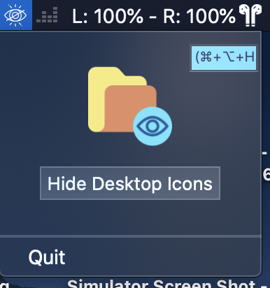
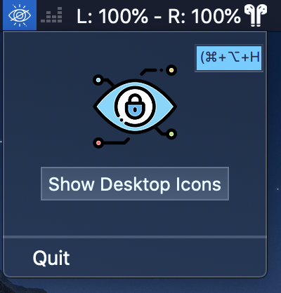

# HideAndSeek 

A small Mac OS App that allow you on Mac OS to show or hide your desktop icons with a single shortcut.

## Getting Started

This is a MacOSX App build with xCode using Swift 5.0 and temporary exceptions in order to handle System Events and Preferences panels events

This App cannot be allowed on the Mac App Store due to the necessary temporary exceptions required.

## How to download directly the App ?

Just download the App zip file here : https://github.com/mohamed-arradi/HideAndSeek/releases

### Screenshots

*Desktop Icons Hidden*

*Desktop Icons Visible*

### Contributing

If you want to contribute to improve it, it will be with pleasure !

### Image Credits

**Icons Credits**:

- Eye Locked Blue (https://www.flaticon.com/free-icon/security_939822?term=eye%20lock&page=1&position=3) from Freepik (https://www.flaticon.com/authors/freepik)

- Eye Folder Yellow (https://www.flaticon.com/free-icon/folder_1333778?term=eye%20folder&page=1&position=57) from icongeek26  (https://www.flaticon.com/authors/icongeek26)

### License

This project is licensed under the MIT License - see the [LICENSE.md](LICENSE.md) file for details

### Support

You like it ? help supporting this app by donating or contributing

